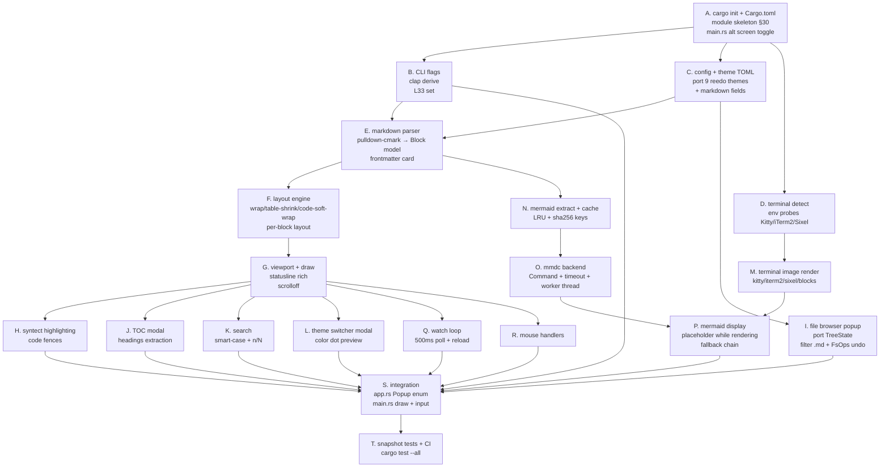

# Veol — Spec (Living Plan)

> Status: **LOCKED** — spec frozen, execution begins.
> Owner: guiwohl · Created: 2026-05-26 · Locked: 2026-05-26
> This file is the **plan of record** and is meant to be iterated on. The sections below are the FLOOR, not the ceiling — add anything the topic demands (UX Spec, Implementation Log, Audit Findings, Architectural Remediation, …).

---

## 1. Goal (one paragraph)

Build **Veol**, a fast, terminal-native Markdown reader in Rust. It renders Markdown beautifully and paginated in the TTY (ratatui + crossterm), highlights code fences (syntect), renders Mermaid diagrams via external `mmdc` displayed inline through Kitty/iTerm2/Sixel image protocols (with graceful fallbacks), and exposes a reedo-clone modal file browser (`Ctrl+E`) restricted to `.md` files + dirs containing them. Theming mirrors reedo's TOML system (`~/.config/veol/themes/*.toml`) with markdown-specific color fields. Watch-on-by-default, stdin support, MIT, TDD throughout. The product is a reader — it does not edit content (CRUD is allowed only on `.md` files as a navigation convenience, never in-buffer editing). Done when `veol README.md` opens an elegant paginated view in <30ms and Mermaid diagrams render without ever blocking text paint.

---

## 2. Locked Decisions

| #  | Decision | Detail |
|----|----------|--------|
| L1 | Project location | New standalone repo at `/home/wohl/W/projects/veol/` — nothing lives inside `reedo/` or `releezy/`. |
| L2 | Spec slug | `veol-spec`. Future iterations get their own files (`veol-v0.2`, etc). |
| L3 | Markdown parser | `pulldown-cmark` — Rust standard (mdBook, rustdoc), event-based, fastest, fits PRD perf targets (<30ms small, <300ms 10MB). GFM extensions enabled: tables, tasklist, strikethrough, footnotes, heading anchors. |
| L4 | Syntax highlighter | `syntect` — Sublime grammars, 200+ langs, zero C deps, simple to embed, theme-friendly. Matches PRD default. |
| L5 | File browser filter | Show only `.md` files + directories that recursively contain at least one `.md`. Empty/non-markdown dirs are hidden. Walk performed once on open, cached per-session, invalidated by `--watch` reload. |
| L6 | Mermaid backend | External `mmdc` (Node CLI). Veol spawns it via `std::process::Command` with timeout (default 1500ms), renders to SVG/PNG, caches at `~/.cache/veol/{sha256}.png`. No browser, no network, no Node embedded. Display happens via terminal image protocol. If `mmdc` missing → graceful source fallback with `npm install` hint. |
| L7 | Image protocol chain | Auto-detect order: Kitty → iTerm2 → Sixel → Unicode blocks → source-only. `--image-protocol <kitty\|iterm2\|sixel\|blocks\|none>` overrides. Detection via `$TERM`, `$TERM_PROGRAM`, env probes per protocol. |
| L8 | Pager default behavior | Heuristic: TUI if stdout is a TTY AND stdin is interactive; otherwise stdout rendering (`--plain` mode auto-enabled). `--pager` / `--no-pager` flags override. Matches `less` / `bat` UX expectations. |
| L9 | Theming heritage | Port reedo's 9 themes verbatim (Default, reedo-dark, reedo-light, catppuccin, dracula, gruvbox, nord, rose-pine, solarized-dark) + add markdown-specific color fields: `heading_1..heading_6`, `link`, `quote_marker`, `quote_text`, `code_bg`, `code_border`, `table_border`, `table_header_fg`, `hr`, `task_done`, `task_pending`, `mermaid_caption`, `search_match`. Reuse reedo's TOML schema and `~/.config/veol/themes/*.toml` custom theme dir. |
| L10 | File browser CRUD | Port reedo's full model: `n` new file / `f` new folder / `r` rename / `d` delete / `m` move-mark + Enter to drop / Ctrl+Z/Y per-session undo of FsOperations (Move/Create/Delete/Rename). Browser is **identical in behavior** to reedo's tree popup. |
| L11 | Open keybind | `Ctrl+E` toggles the browser (open / close). Matches reedo muscle memory. |
| L12 | Open-file behavior | Opening a `.md` from the browser **replaces the current document** in the same Veol process. No multi-buffer, no tabs, no spawning subprocesses. `q` quits cleanly from anywhere. |
| L13 | No git status in browser | Veol is a reader; git state is irrelevant to reading. Cuts `git status` subprocess, refresh loop, and the M/A/D/? color logic from reedo. |
| L14 | Mermaid cache policy | LRU + size-bound (default `max_size_mb = 128`, override via config). Each cache hit bumps mtime. On overflow, evict LRU until under budget. On Veol startup, GC sweeps orphans unused for >30 days. Manual reset via `veol --clear-cache`. Path: `~/.cache/veol/`. |
| L15 | Modal interaction | Modal **only inside the browser** (no global vim modes for the reader). Browser default = navigation mode (j/k/n/f/r/d/m/...); pressing `n`/`f`/`r` enters input mode with prompt; Esc cancels back to navigation. Matches reedo. Reader outside the browser has flat keybinds (no modes). |
| L16 | CRUD extension policy | When user types a filename via `n`, Veol auto-appends `.md` if missing. Names containing any other extension are rejected with inline error "Veol only creates .md files". Browser stays in sync with the `.md`-only filter — no ghost files. Folders (`f`) accept any name. |
| L17 | Name & binary | `Veol` / `veol`. Tagline: *"Fast Markdown reading for the terminal."* |
| L18 | Search engine | Case-insensitive literal with smart-case (uppercase chars in query → case-sensitive). No regex in MVP. `/` opens, `n`/`N` next/prev, Esc cancels. |
| L19 | TOC presentation | Centered modal popup (70%×70%, same shell as file browser). Toggle `t`. Heading hierarchy with indentation, Enter to jump, Esc to close. Reuses the popup widget primitives from the browser. |
| L20 | Watch mode | **Always-on by default**. Polling every 500ms via `std::fs::metadata` mtime comparison (mirrors reedo's external file change detection). Reload triggers full re-parse + Mermaid re-render (cache invalidation only on actual content change). Opt-out with `--no-watch`. The previous `--watch` flag becomes redundant and is removed from the CLI. Auto-disabled when input is stdin (no file to watch). |
| L21 | Stdin handling | Read fully until EOF into an in-memory buffer, then parse + render. Disables watch + reload (no file). Matches reedo's behavior. Acceptable trade-off for agentic flows (`claude -p ... \| veol -`) — user already waits for the producer. |
| L22 | Statusline content | Rich-but-concise default: `{filename}  {percent}%  line {n}/{total}  •  mermaid: {rendered}/{total}` (mermaid segment hidden if doc has none). Single line, never two. Theme-controlled colors. |
| L23 | Async runtime | Pure `std::thread` + `mpsc::channel`. Mermaid renders spawn a worker thread per diagram, main loop receives `MermaidResult` events on the channel. No `tokio`, no async ecosystem overhead. ~50 fewer dependencies, smaller binary. |
| L24 | Mouse support in MVP | Yes — click to select tree entry, scroll wheel to scroll viewport / tree / TOC. Mirrors reedo's `handle_mouse` routing pattern. No drag-select in MVP (deferred to v0.2 since Veol is read-only). |
| L25 | XDG paths | Use `directories` crate. Config: `~/.config/veol/config.toml`. Cache: `~/.cache/veol/`. Custom themes: `~/.config/veol/themes/*.toml`. Cross-platform out of the box; reedo uses `dirs` (sister crate) — same pattern. |
| L26 | Frontmatter rendering | Render as an elegant table card at the top of the doc — two-column grid (`key` / `value`), themed border, themed key-color. Both YAML and TOML detected. Toggleable hide with `f` keybind (frontmatter). Hidden by default if config has `frontmatter = false`. |
| L27 | Footnotes | Included in MVP. Enable pulldown-cmark `ENABLE_FOOTNOTES`. Render: superscript-styled ref `[1]` inline (colored, themed), and footnote bodies in a themed block at the bottom of the doc section where they were defined. |
| L28 | Link handling | Inert by default — links are styled but never auto-opened, no network calls. Keybind `gx` over a link (cursor on the link span) spawns `$BROWSER` or `xdg-open` (Linux), `open` (macOS), `start` (Windows). External execution only; Veol stays clean. |
| L29 | Error model | `anyhow` for app-level code (idiomatic, ergonomic). Typed `thiserror` enums at the `mermaid/` and `terminal/` module boundaries where the caller needs to distinguish (e.g., `MermaidError::Timeout` vs `MermaidError::ParseError` vs `MermaidError::BinaryMissing`). Matches reedo's pragmatism. |
| L30 | Logging | `tracing` + `tracing-appender` to `~/.cache/veol/veol.log` (rolling daily, keep 7 files). Level via `RUST_LOG=veol=debug`. Zero output to user terminal — TUI must stay clean. Mirrors reedo's logging stack. |
| L31 | Config file | TOML at `~/.config/veol/config.toml`. PRD schema (theme, image_protocol, mermaid_timeout_ms, show_statusline, show_toc, wrap, `[cache]`, `[keymap]`) + L9 extended color fields. Same TOML conventions and parser as reedo (serde + toml crate). |
| L32 | MVP scope | Ship complete PRD MVP **plus** file browser (L10-L16) **plus** theming (L9) **plus** footnotes (L27). Nothing cut. The added popups (browser, TOC, theme switcher) all share the same widget primitives — total cost is ~3 widget files, not 3 systems. |
| L33 | CLI flags | `--pager / --no-pager / --plain / --theme <name> / --theme-list / --width <cols> / --no-mermaid / --mermaid-timeout <ms> / --mermaid-cache <dir> / --clear-cache / --no-watch / --toc / --line-numbers / --config <path> / --image-protocol <auto\|kitty\|iterm2\|sixel\|blocks\|none> / --debug-render / --version / --help`. Removed: `--watch` (default). Added: `--no-watch`, `--theme-list`. |
| L34 | Keybinds | PRD set as foundation + reedo extensions. Reader: `q` quit, `j/k` line scroll, `Space/PgDn` page down, `b/PgUp` page up, `d/u` half-page, `g/G` top/bottom, `/` search, `n/N` next/prev match, `t` toggle TOC modal, `r` reload, `m` toggle Mermaid render/source, `?` help overlay, `]/[` next/prev heading, `Esc` close popup → normal mode (layered like reedo), `Ctrl+E` toggle file browser, `Ctrl+T` toggle theme switcher, `gx` open link externally, `f` toggle frontmatter. Browser inherits reedo's modal keys (`n/f/r/d/m`, 1-9 hint jump, `⌫` back). |
| L35 | Packaging MVP | `cargo install veol` only. Pre-compiled binaries + .deb/AUR/brew deferred to v0.2. Keeps the release pipeline trivial (no GitHub Actions matrix yet). |
| L36 | Tests & license | Unit tests for parser → block model conversion + `insta` snapshot tests for rendered output (block model → ratatui buffer). License: MIT (same as Anthropic-published Rust tooling default, maximum permissive). Pre-commit / CI test runner: `cargo test --all`. |
| L37 | Code wrap | Soft-wrap on for code fences and prose (`wrap = true` default). Wrap respects fence boundaries (continuation indent). PRD-aligned. |
| L38 | Wide tables | Auto-shrink columns: compute proportional widths within terminal width, word-wrap within cells. Row height grows; no horizontal scroll. Matches `glow`/`mdcat` reader UX. |
| L39 | Local images | Render as placeholder text `[image: {alt}]` in MVP (PRD-aligned). Defer image-protocol rendering for non-mermaid assets to v0.2. |
| L40 | Mermaid toggle scope | Global toggle: `m` cycles document-wide `rendered → source → rendered`. No per-diagram state — simple mental model. |
| L41 | TDD discipline (P0) | **Every feature ships with tests written FIRST.** RED → GREEN → REFACTOR. No code is merged without a failing test that proves the new behavior. Use `/tdd` skill for every implementation task. Snapshot tests via `insta` for any rendered output; unit tests for parser/model/layout/mermaid extraction/cache; integration tests for CLI flag handling. CI gate: `cargo test --all` must pass before any merge. |
| L42 | AI instructions surface | Create `veol/.claude/CLAUDE.md` mirroring releezy's structure (Core Beliefs P0/P1/P2 → NEVER → What is Veol → Architecture → CLI → Git → Testing). Source of truth for AI sessions; references this spec file. Sub-module CLAUDE.md files only when hard-won knowledge accumulates (per reedo's "obvious from code → skip" rule). |

---

## 3. Open Decisions

---

## 4. Codebase Findings

_Reedo is the reference for the file browser and theming. Veol is a NEW repo at `/home/wohl/W/projects/veol/` — fresh `Cargo.toml`, no inheritance of code, only architectural patterns. Below: what to mirror from reedo._

### 4.1 Reedo stack (relevant subset)

- `crossterm = "0.28"` for terminal I/O and raw mode.
- `ratatui = "0.29"` for TUI widgets — same as Veol PRD.
- `serde = "1"` + `toml = "0.8"` for config/theme parsing.
- `dirs = "5"` for XDG paths (`~/.config/...`, `~/.cache/...`).
- `clap = "4"` derive for CLI.
- `tracing` for logging.

### 4.2 Reedo file-browser shape (`src/ui/tree.rs`)

- Single struct `TreeState`:
  - `entries: Vec<TreeEntry>` — flat list with `depth` field
  - `selected: usize`
  - `scroll_offset: usize`
  - `open_dirs: HashSet<PathBuf>`
  - `root: Option<PathBuf>`
  - `action: TreeAction` (None / NewFile / NewFolder / Rename / Delete)
  - `input_buf: String`
  - `marked_for_move: Option<PathBuf>`
  - `fs_undo_stack` / `fs_redo_stack: Vec<FsOperation>`
  - `hint_scope: Option<PathBuf>` + `hint_indices: Vec<usize>` (1-9 jump keys)
- `TreeEntry { path, name, is_dir, depth, color, git_status, is_last_sibling }`.
- `FsOperation` enum: `Move | Create | Delete | Rename`. Undo/redo per-session.
- Render: centered modal, ~70%×70%, single-border box, title row = project root with `nf-fa-home` icon, hint bar at bottom, nerd-font icons per ext, tree-guide chars (`├── └── │`), folder color cycling palette (8 colors).
- Selection at index 0 = root selection (used for move-to-root).
- Hint keys (1-9) jump to siblings of current scope; `⌫` back to parent scope.

### 4.3 Reedo theming (`docs/theming.md` + `src/config/theme.rs`)

- 9 bundled themes: `Default`, `reedo-dark`, `reedo-light`, `catppuccin`, `dracula`, `gruvbox`, `nord`, `rose-pine`, `solarized-dark`.
- Custom themes in `~/.config/reedo/themes/*.toml`.
- Color values: hex (`#rrggbb`), `default` (terminal default), ANSI names (`blue`, `bright-black`).
- Color fields (reedo's set): `bg`, `fg`, `gutter`, `cursor_bg`, `cursor_fg`, `selection`, `statusbar_bg`, `statusbar_fg`, `keyword`, `string`, `comment`, `function`, `type`, `number`, `operator`, `property` (+ popup_bg/border/selected/dim/accent via `Theme::popup_*` methods used in tree widget).
- Runtime switcher modal (Ctrl+T) with color preview dots, persists to config.

### 4.4 Reedo widget pattern (re-use as architectural template)

1. `FooState` with data + input methods.
2. `FooWidget<'a> { state: &'a FooState, theme: &'a Theme }` — borrows state and theme.
3. `impl Widget for FooWidget` — custom render directly to `Buffer`.
4. Popup enum variant in `app.rs` (mode dispatch).
5. State field in `App`, `::default()` init.
6. Render arm in `main.rs` `terminal.draw` closure.
7. Input arm in `handle_popup_input()`.

### 4.5 PRD reference (Veol)

- Full PRD provided in conversation; key directives:
  - Rust + ratatui + crossterm + pulldown-cmark.
  - External `mmdc` for Mermaid, cached, async, never blocks text paint.
  - CLI flags: `--pager / --no-pager / --plain / --theme / --width / --no-mermaid / --watch / --toc / --image-protocol / --debug-render / ...`.
  - Performance targets: `<30ms` startup for <100KB files; `<300ms` for 10MB.
  - Security: no network, `Command` args only (no shell strings), timeout-bound `mmdc`.

### 4.6 Veol-specific deltas (the things the PRD does NOT cover)

- File-browser popup (the user explicitly requested it — IDENTICAL behavior to reedo's).
- File-browser must filter to `.md` only (and dirs that lead to `.md` files — TBD).
- Theming system identical-in-feel to reedo (TOML + bundled set + switcher).
- Both features are NEW relative to the PRD, which doesn't mention either explicitly.

---

## 5. Structured Analysis

### 5.1 Problem Model

User reads markdown files (READMEs, ADRs, PRDs, agent-generated specs) in a terminal-heavy workflow. Existing tools fall short: `cat`/`bat` show source, `glow` is good but Mermaid is second-class, browsers are heavy/context-switchy. The hidden constraint surfaced during grilling: **Veol is a READER, not an editor** — file-browser CRUD exists only as a navigation convenience (rename/delete/move `.md` files between reads), never to mutate buffer content. The product wins on speed + Mermaid + reedo-aesthetic familiarity.

### 5.2 System Impact

New standalone crate. Module layout from PRD §30 stands. Reuse-by-pattern (not by code) from reedo:

| Reedo pattern | Veol consumer |
|---|---|
| `ui/tree.rs` `TreeState` + modal `FileTreeWidget` | `src/tui/browser.rs` — full port, filtered to `.md`. |
| `config/theme.rs` TOML themes + bundled set | `src/render/theme.rs` — port 9 themes + add markdown color fields. |
| `ui/theme_switcher.rs` modal | `src/tui/theme_switcher.rs` — same pattern. |
| `app.rs` `Popup` enum dispatch + `handle_popup_input` | `src/app.rs` — same dispatch model. |
| `tracing` + `tracing-appender` to file | `src/main.rs` log init — same setup. |
| reedo's `External file change` poll (~1s) | always-on, 500ms poll in main loop. |

Deep modules to extract:
- `mermaid/` (extract + cache + backend + display) — simple interface (`render(source) → DisplayAsset`), rich internals (cache, mmdc spawn, timeout, fallback).
- `terminal/` (detect + image protocols) — simple interface (`render_image(bytes, dims) → ()`), per-protocol encoders inside.

### 5.3 Strategies

**Recommended — Pattern reuse (NOT code copy)**: New crate, fresh code, but mirror reedo's widget/popup architecture and theme schema. Cheapest long-term; Veol stays lean (no editor cruft), but inherits the visual/UX consistency.

**Rejected — Workspace shared crate with reedo**: Pulls reedo dependencies (ropey, tree-sitter, arboard) we don't need; couples release cycles; semantically wrong (editor + reader are different products).

**Rejected — Fork reedo and gut**: Removes a lot, but every change leaks pre-existing assumptions. Slower than greenfield.

### 5.4 Risks

| Risk | Mitigation |
|---|---|
| Mermaid `mmdc` not installed → bad UX | Graceful source fallback + clear install hint (PRD §24). Detect once on first mermaid fence encountered. |
| Image protocol detection wrong → broken render | Conservative chain (Kitty/iTerm2/Sixel/blocks/source) + `--image-protocol` override. Log decisions to `veol.log`. |
| Cache grows unbounded | L14 LRU + size budget + 30d GC sweep. `veol --clear-cache` escape hatch. |
| Watch interferes with reading flow | Reload preserves viewport position by line number when possible; flash status "reloaded" briefly. |
| Browser delete is irreversible | L10 per-session FsOperation undo stack (Ctrl+Z/Y) — same as reedo. |
| Large file (>10MB) slows first paint | MVP parses whole file; PRD §18 future strategy if it becomes a problem. |
| `pulldown-cmark` GFM gaps (math, callouts) | Acceptable for MVP; v0.2 can add `comrak` switch. |

### 5.5 Validation

External behavior checks (every one = a test):

1. `veol README.md` → opens TUI, first paint <30ms for <100KB. Assert via timing test.
2. `cat foo.md | veol -` → renders piped content, watch auto-disabled.
3. `q` quits cleanly (restores terminal, no zombie state).
4. `/` `n` `N` navigate matches; smart-case respects uppercase.
5. `Ctrl+E` opens browser; filter shows only `.md` and dirs with `.md`; `n` creates `notes.md` (auto-extension); `r` renames; `d` deletes with confirm; `Ctrl+Z` undoes.
6. `Ctrl+T` opens theme switcher; selecting a theme persists to config + applies immediately.
7. Mermaid: `mmdc` available + Kitty terminal → renders; without `mmdc` → source fallback with hint; without image protocol → block fallback then source.
8. `m` toggles all diagrams rendered ↔ source.
9. File mutated externally → 500ms later viewport reloads, position preserved.
10. `cargo test --all` passes; snapshot tests via `insta` cover layout output per block type.

Test layout (`tests/` + per-module `#[cfg(test)] mod tests`):
- `tests/cli_smoke.rs` — CLI flag matrix.
- `src/markdown/parser.rs` unit tests for event → block conversion.
- `src/render/*.rs` snapshot tests (insta).
- `src/mermaid/cache.rs` cache hit/miss/evict tests with `tempfile`.
- `src/terminal/detect.rs` env-based detection tests.

### 5.6 Out of Scope

| Item | Why deferred |
|---|---|
| Multi-buffer / tabs | Reader, not editor. PRD §5. |
| Plugin system | YAGNI for MVP. |
| Math (KaTeX/MathJax) rendering | pulldown-cmark gap; add post-MVP. |
| Native Mermaid Rust renderer | Not feasible; `mmdc` covers it. |
| Browser fallback for Mermaid | Violates "no browser" principle. PRD §5. |
| `.deb` / AUR / Homebrew packaging | v0.2 — cargo install suffices for MVP audience. |
| Drag-select mouse | Read-only product. Click + scroll only. |
| Per-diagram mermaid toggle | L40 — global toggle good enough. |
| Streaming stdin parse | L21 — read fully, then render. |
| Git status in browser | L13 — reader doesn't care. |
| Section folding | v0.4 per PRD §27. |
| Virtualized large files | v0.4 per PRD §27. |

### 5.7 Recommended Plan

Same-depth nodes are parallelizable (A→B,C,D; B+C→E; etc). Encode into TaskManager with `blockedBy` when executing.

### 5.8 Next Action

Spawn a subagent to **bootstrap the cargo project**: create `/home/wohl/W/projects/veol/{Cargo.toml,src/main.rs,src/lib.rs,src/<module skeletons per PRD §30>}` with `cargo check` passing, a hello-world TUI alternate-screen entry/exit, and an `insta` snapshot test that asserts the empty viewport renders the welcome placeholder. This is node A of §5.7.
