# Veol — Kitchen Sink

A single document that exercises every feature Veol claims to support. Open it with `veol examples/kitchen-sink.md` and walk through each section. Each subsection has a **What to check** note describing what you should see.

> **How to use this file.** Open the file with Veol in a terminal at least 120 columns wide so you can see the centered content band. Press `t` for the TOC modal, `Ctrl+E` for the file browser, `Ctrl+T` for the theme switcher, `/` for search, `m` to toggle Mermaid render/source, `?` for help, `q` to quit.

---

## 1. Frontmatter card

The block at the top of this file is YAML frontmatter. **What to check:** Veol should render it as a small bordered card with `title / author / date / tags / status` keys and their values, near the top of the document. Press `f` to toggle the card visibility.

---

## 2. Headings — all six levels

# H1 — biggest heading

## H2 — second level

### H3 — third level

#### H4 — fourth level

##### H5 — fifth level

###### H6 — smallest heading

**What to check:** each level uses a distinct color from `heading_1..6` in the active theme. Try `Ctrl+T` and switch themes to see the palette swap. Press `]` and `[` to jump between headings.

---

## 3. Inline span styles

This paragraph has **bold text**, *italic text*, ***bold italic***, ~~strikethrough text~~, `inline code`, and a [link to anthropic.com](https://anthropic.com). It also has a mix of all of them in one line: **a [bold link with `code`](https://example.com) inside it**, plus ~~*italic strike*~~.

**What to check:** every span style is visually distinct. Links should be underlined and use the theme's `link` color. Inline code should have a subtle background.

---

## 4. Paragraphs — soft wrap + centering

This is a normal paragraph with enough content to definitely wrap on most terminal widths. It is centered when the terminal is wider than 120 columns, with a maximum content band of 100 columns and equal left/right padding. On narrower terminals it should fill the screen.

Another paragraph follows. They should be separated by a blank line. The wrap should happen at word boundaries, not mid-word. Lorem ipsum dolor sit amet, consectetur adipiscing elit, sed do eiusmod tempor incididunt ut labore et dolore magna aliqua. Ut enim ad minim veniam, quis nostrud exercitation ullamco laboris nisi ut aliquip ex ea commodo consequat.

**What to check:** lines wrap at word boundaries. Both paragraphs share the same left-margin offset. On a >120-col terminal, content is narrower than the screen with equal padding on both sides.

---

## 5. Blockquotes

> Single-level blockquote. Should render with `│ ` marker prefix in the `quote_marker` theme color and text in `quote_text` color.

> Multi-line blockquote.
>
> Spans two paragraphs. The blank line between them should be respected, but the `│ ` marker continues on the blank line so the visual block stays cohesive.

> Nested blockquote example.
>
> > A second-level quote inside the first.
> >
> > > And a third-level quote inside that.

**What to check:** each nesting level adds another `│ ` to the prefix. Color stays consistent.

---

## 6. Unordered lists

- Top-level item one
- Top-level item two
  - Nested item under two
  - Another nested item
    - Three-levels-deep item
    - Sibling at three deep
  - Back to two-deep
- Top-level item three with a long line that should wrap onto a second line — when it wraps, the continuation should be indented to match the text column, not the bullet column

**What to check:** bullet marker is `•` (a centered dot). Nested items are indented by 2 cells per level. Wrap continuation aligns with the text, not the bullet.

---

## 7. Ordered lists

1. First item
2. Second item
3. Third item with a long enough line to wrap, again with continuation indented to the text column not the number column lorem ipsum dolor sit amet
4. Fourth item
   1. Nested ordered item
   2. Another nested ordered item
5. Fifth item

10. Ordered list starting at 10
11. Eleven
12. Twelve

**What to check:** numbers render with `.` after them. Numbers right-align across the list. Lists starting at a non-1 number preserve their starting index.

---

## 8. Task lists

- [x] Done task — should render with a filled checkbox and `task_done` theme color, bold
- [ ] Pending task — empty checkbox, `task_pending` color
- [x] Another done task with **bold inline** styling preserved
- [ ] Pending task with a [link](https://example.com)
  - [x] Nested done
  - [ ] Nested pending

**What to check:** `[x]` and `[ ]` markers are distinct. Inline span styles still apply inside the task text.

---

## 9. Mixed nested lists

1. Ordered item with unordered children
   - Bullet child A
   - Bullet child B
     1. Deeper ordered grandchild
     2. Another grandchild
2. Ordered item two
   - [x] Task inside ordered list
   - [ ] Another task

**What to check:** marker switches correctly between bullet and number based on the list type. Indentation accumulates cleanly.

---

## 10. Code fences — multiple languages

Plain code (no language label):

```
this has no language
just some text
multiple lines
```

Rust:

```rust
fn main() {
    let greeting = "hello, veol";
    println!("{}", greeting);
    let numbers: Vec<i32> = (1..=10).collect();
    let sum: i32 = numbers.iter().sum();
    assert_eq!(sum, 55);
}
```

Python:

```python
def fibonacci(n):
    """Yield the first n Fibonacci numbers."""
    a, b = 0, 1
    for _ in range(n):
        yield a
        a, b = b, a + b

if __name__ == "__main__":
    print(list(fibonacci(10)))
```

JavaScript:

```javascript
const greet = (name) => `Hello, ${name}!`;
const users = ["alice", "bob", "charlie"];
users.map(greet).forEach(msg => console.log(msg));
```

TypeScript:

```typescript
interface User {
    name: string;
    age: number;
}
const greet = (user: User): string => `Hi, ${user.name} (${user.age})`;
```

Bash:

```bash
#!/usr/bin/env bash
set -euo pipefail
for f in *.md; do
    veol --plain "$f" > "${f%.md}.txt"
done
echo "done"
```

Go:

```go
package main

import "fmt"

func main() {
    nums := []int{1, 2, 3, 4, 5}
    sum := 0
    for _, n := range nums {
        sum += n
    }
    fmt.Println(sum)
}
```

C:

```c
#include <stdio.h>
int main(void) {
    printf("hello, veol\n");
    return 0;
}
```

TOML:

```toml
[package]
name = "veol"
version = "0.1.0"

[dependencies]
ratatui = "0.29"
```

YAML:

```yaml
name: ci
on: [push, pull_request]
jobs:
  test:
    runs-on: ubuntu-latest
```

JSON:

```json
{
  "name": "veol",
  "version": "0.1.0",
  "features": ["mermaid", "themes", "browser"]
}
```

**What to check:**
- Each block has a language label tag on its first row.
- Each language is highlighted differently (keywords / strings / comments / numbers in distinct colors).
- Multi-line strings and `/* */` style comments keep their color across lines.
- Code blocks **break out of the centered content band** — they use more horizontal space than prose paragraphs. The padding is much smaller (about 2 cells) compared to prose.

---

## 11. Long code line wrap

```rust
fn this_is_a_function_with_a_deliberately_extremely_long_name_to_force_horizontal_wrapping_or_clipping_depending_on_the_terminal_width(input: &str, additional_argument_to_make_it_even_longer: Vec<String>) -> Result<String, anyhow::Error> { Ok(format!("{}{:?}", input, additional_argument_to_make_it_even_longer)) }
```

**What to check:** the line either wraps with a 2-space continuation indent or stays on one row if the terminal is wide enough. No text disappears off-screen silently.

---

## 12. Tables

Simple 2x3 table:

| Name      | Role        | Tenure |
|-----------|-------------|--------|
| Alice     | Engineer    | 3 yrs  |
| Bob       | Designer    | 5 yrs  |
| Charlie   | PM          | 2 yrs  |

With column alignments (left / center / right):

| Left aligned | Centered | Right aligned |
|:-------------|:--------:|--------------:|
| a            | b        | c             |
| longer cell  | mid      | 42            |
| x            | y        | 10000         |

Wide table that forces column-shrink (each cell is intentionally long enough to need wrapping):

| Heading one with a long title | Heading two with another long title | Heading three is also long |
|-------------------------------|-------------------------------------|----------------------------|
| Some content in cell one      | More content in cell two            | And cell three has stuff   |
| Second row first cell text    | Second row second cell text         | Second row third cell      |

**What to check:**
- Top and bottom borders with rounded corners `┌─┐ └─┘`.
- Header separator `├─┼─┤` after the header row.
- **Horizontal dividers `├─┼─┤` between every data row** (recent fix — confirm they appear).
- Column alignment honors the markdown alignment markers.
- Wide tables auto-shrink columns with word-wrap inside cells; row height grows.

---

## 13. Horizontal rule

Above the rule.

---

Below the rule. Three or more dashes on a line by themselves produce one of these.

**What to check:** a horizontal line themed `hr` color stretches across the content band.

---

## 14. Footnotes

This sentence has a footnote reference [^short] and another one [^long-key]. Here is a third reference [^short] reused. They should render as styled superscript-ish markers inline.

[^short]: This is the body of the short footnote.
[^long-key]: This is the body of the long-key footnote. Footnote bodies can themselves have **bold** or *italic* spans, and even `inline code`.

**What to check:** the inline references are distinguishable from regular text (themed `link` color). The footnote definitions render as a block at the end of the section with their label and body text.

---

## 15. Images (placeholder in MVP)


Inline reference: see  for another example.

**What to check:** in MVP, images render as `[image: <alt>]` placeholder text. (Real terminal-image rendering for non-mermaid assets is post-MVP.)

---

## 16. Mermaid diagrams

A simple flowchart:

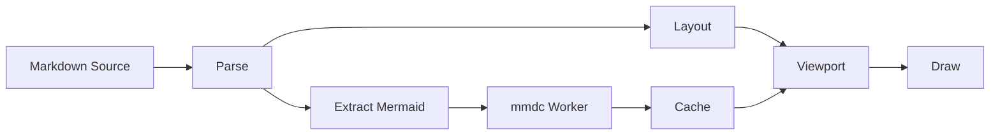

A sequence diagram:

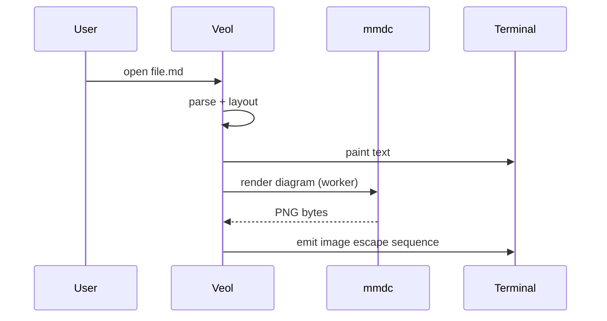

A state diagram:

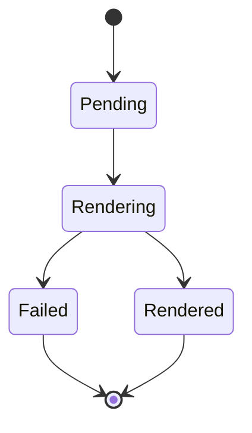

Using the `mmd` alias:

```mmd
graph TD
    Start --> Middle
    Middle --> End
```

Using the `mermaid-js` alias:

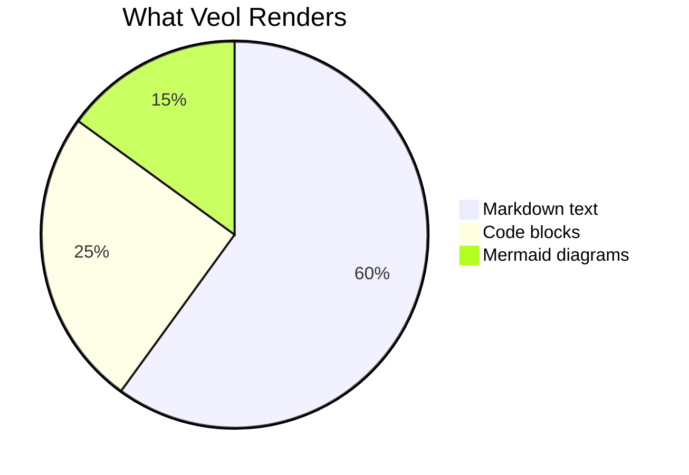

**What to check:**
- If `mmdc` is installed AND your terminal supports Kitty / iTerm2 / Sixel image protocols, you see rendered images.
- If `mmdc` is missing, you see source-fallback blocks with a `[ Mermaid render failed ]` style note and an install hint.
- If your terminal lacks an image protocol, you see the source as a fallback.
- Press `m` to toggle ALL diagrams between rendered and source modes. The toggle is global.
- All three aliases (`mermaid`, `mmd`, `mermaid-js`) are detected as Mermaid fences.

---

## Mermaid — every supported diagram type (smoke tests)

The blocks below exercise every diagram type Veol's pure-Rust ASCII renderer claims to support. Each block should either render to an ASCII drawing, or fall back to a clearly-noted source block (`// mermaid: <reason>`). No block should panic.

## Flowchart (TD)

Top-down flowchart with three nodes.

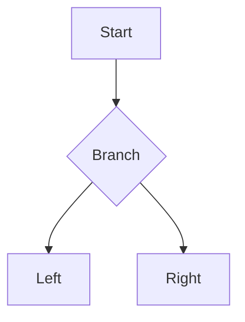

## Flowchart (LR)

Left-to-right flowchart.

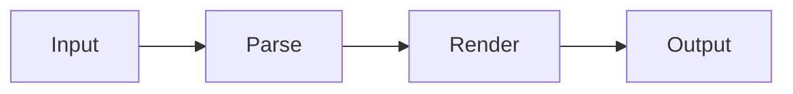

## Sequence Diagram

Two-actor message exchange.

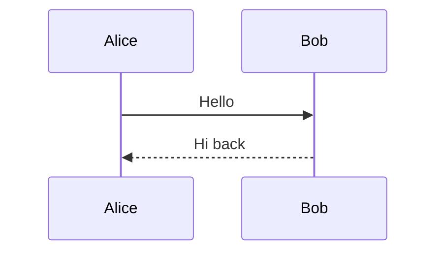

## Class Diagram

Single inheritance with a method.

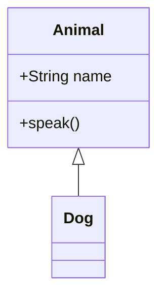

## State Diagram

State machine with terminal states.

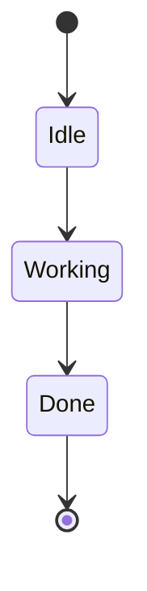

## ER Diagram

Customer-order relationship.

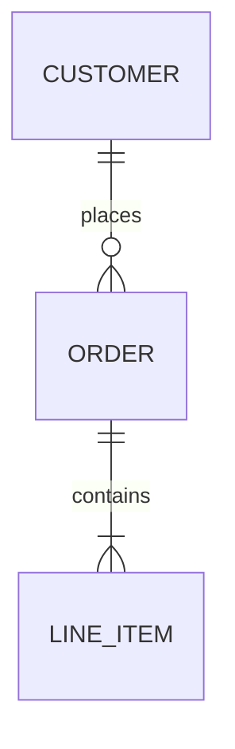

## Pie Chart

Three-slice pie with title.

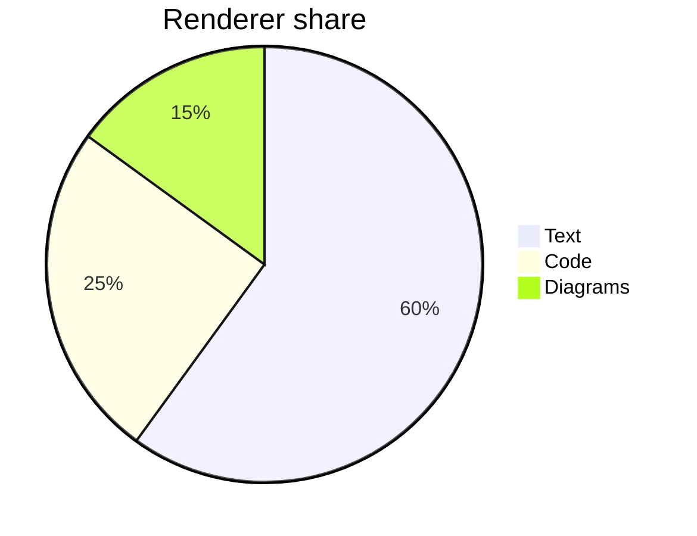

## Gantt Chart

Two-task project schedule.

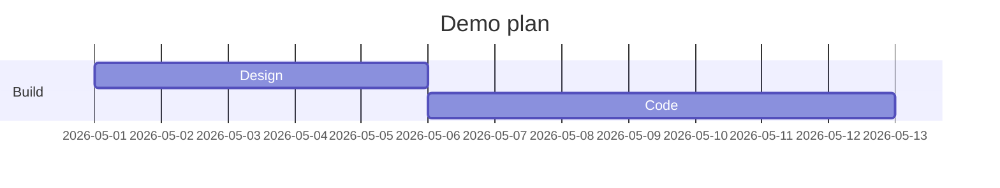

## User Journey

Single-section journey with three tasks.

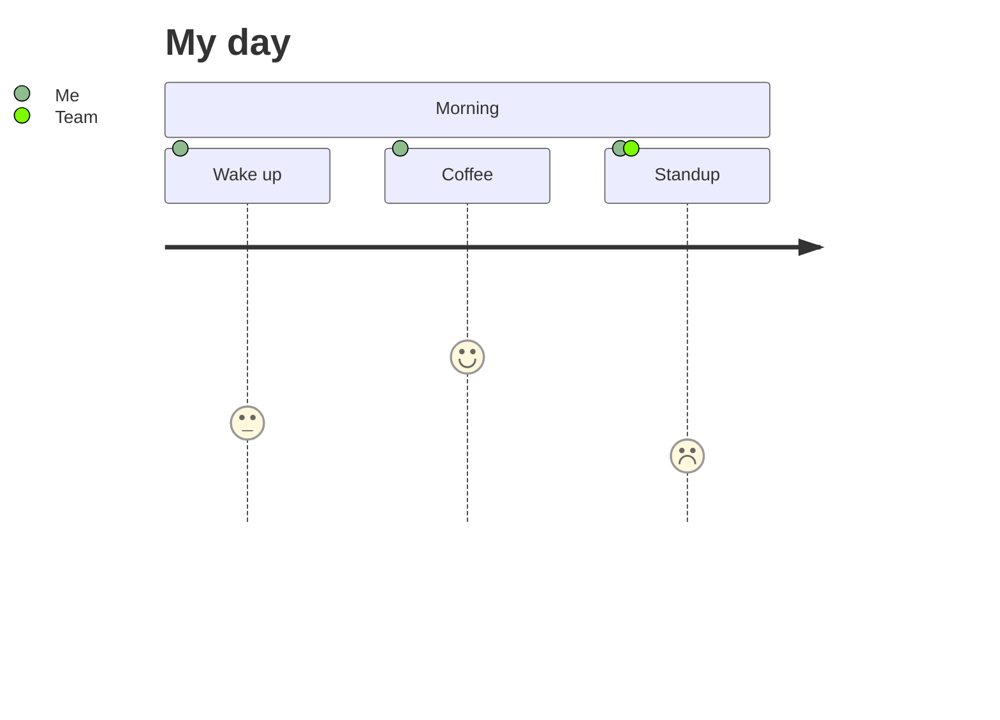

## Timeline

Three-event timeline.

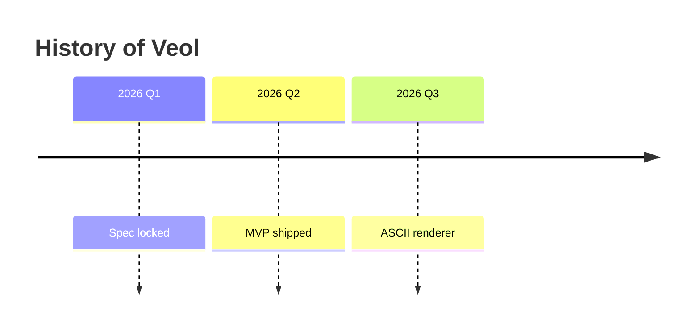

## Mindmap

Two-level mindmap.

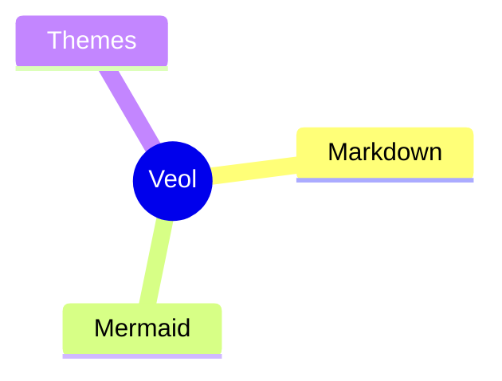

## Git Graph

Two-branch commit log.

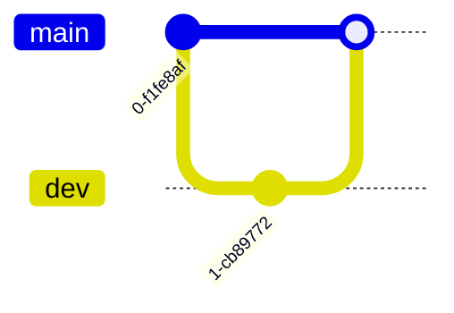

## Quadrant Chart

Standard 2x2 quadrant with points.

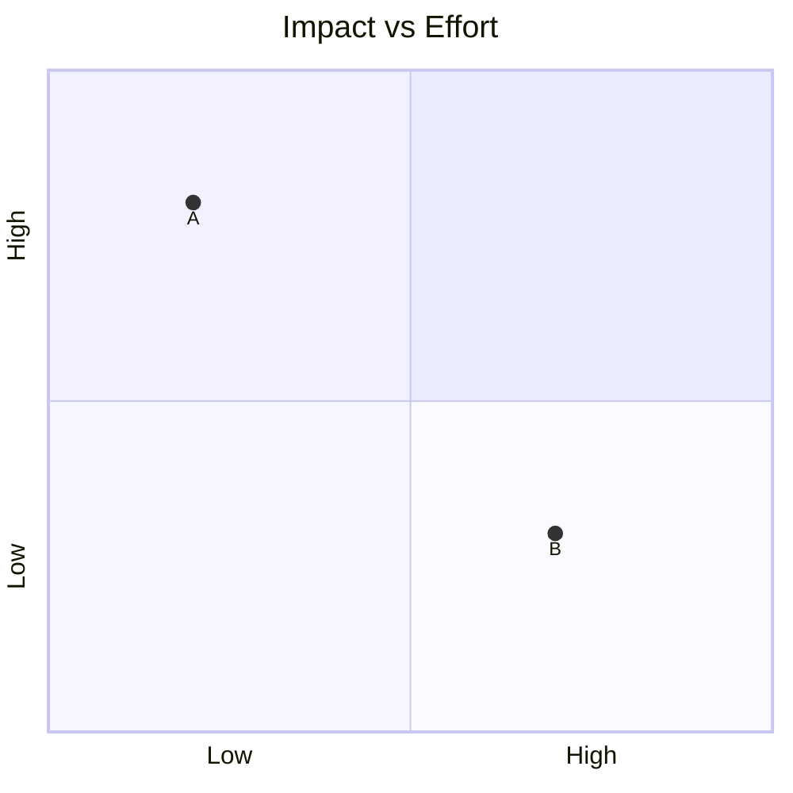

## Requirement Diagram

One requirement with an element.

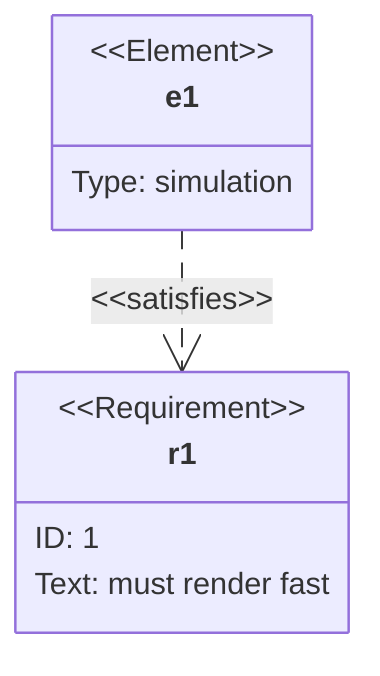

## Sankey

Three-flow Sankey.

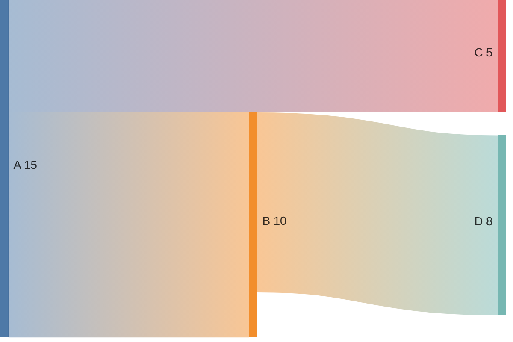

## XY Chart

Bar chart with line.

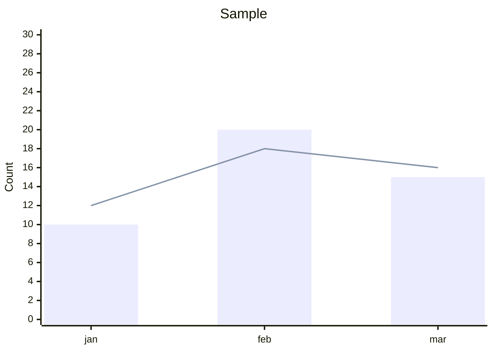

## Block Diagram

Three-column block layout.

```mermaid
block-beta
    columns 3
    A B C
    D:3
```

## Architecture Diagram

One group with two services.

```mermaid
architecture-beta
    group api(cloud)[API]
    service web(server)[Web] in api
    service db(database)[DB] in api
    web:R --> L:db
```

## Packet Diagram

Two-field packet layout.

```mermaid
packet-beta
0-15: "Source port"
16-31: "Destination port"
```

---

## 17. Long heading for navigation test

### Heading with a relatively long title to test horizontal layout

### Another heading right after to test `]` jump

#### Subheading underneath

##### Deeper subheading

Some content under the deepest subheading. Type `t` to open the TOC and confirm every heading here is listed with correct nesting.

---

## 18. Search test bait

Veol Veol Veol — this triplet exists so you can hit `/Veol` and confirm forward / backward navigation with `n` and `N`. Try `/veol` in lowercase to test smart-case (should match all). Then `/Veol` with uppercase V (should still match all — smart-case kicks in when query has upper, becoming case-sensitive, so `/Veol` matches only the cap-V occurrences, not lowercase `veol` references elsewhere in the doc).

The word `pineapple` appears here exactly once for a single-match test.

The word `BANANA` appears here once in screaming case — search for `BANANA` to test exact case-sensitive matching via smart-case.

---

## 19. File browser test

Press `Ctrl+E` to open the modal file browser. **What to check:**
- The browser shows only `.md` files plus directories that contain `.md` files (recursively).
- `.git/`, `node_modules/`, and `target/` are hidden.
- Try `n` to create a new file — `notes` should auto-append `.md`, `notes.txt` should be rejected with an inline error.
- Try `r` to rename, `d` to delete, `m` to mark-then-move.
- `Ctrl+Z` / `Ctrl+Y` undo / redo filesystem operations within the session.
- Digit keys `1`-`9` jump to siblings of the current scope.
- `Esc` closes the browser.

---

## 20. Theme switcher test

Press `Ctrl+T` to open the theme switcher modal. **What to check:**
- All 9 bundled themes are listed (Default, reedo-dark, reedo-light, catppuccin, dracula, gruvbox, nord, rose-pine, solarized-dark).
- Each row shows 6 color preview dots reflecting that theme's palette.
- Pressing Enter applies the theme immediately and persists it to `~/.config/veol/config.toml`.
- Esc cancels without persisting.

---

## 21. Watch mode

Veol always watches the source file (default behavior). **What to check:**
- Edit this file in another editor while Veol has it open. Within ~500ms Veol should re-render and the statusbar should flash "reloaded".
- The viewport position should be preserved across reload.
- Run with `--no-watch` to disable this behavior if needed.

---

## 22. Statusbar

The statusbar at the bottom of the screen should show:
- The filename (or `[stdin]` if piped).
- Percentage scroll position.
- `line {top}/{total}`.
- `mermaid: rendered/total` (only when the doc has Mermaid blocks).
- Flash messages right-aligned (transient, ~2.5s).

---

## 23. End of document

If you reached here by pressing `G`, scrolling, or paging — congratulations, you've exercised the full reader surface. Press `g` to jump back to the top, or `q` to quit.

The shortest line.
